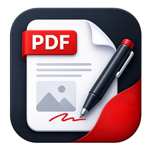

<p align="center">
  
</p>

<h1 align="center">Ayaan PDF</h1>

<p align="center">
  <b>The PDF editor that speaks Hindi and Myanmar.</b><br>
  Read, mark up, sign and truly edit PDFs on Windows. Free, open source, and it works offline.
</p>

<p align="center">
  <a href="../../releases/latest"><b>Download for Windows</b></a>
  &nbsp;·&nbsp;
  <a href="#what-it-can-do">What it can do</a>
  &nbsp;·&nbsp;
  <a href="#build-it-yourself">Build it yourself</a>
</p>

<p align="center">
  <a href="LICENSE"></a>
  
  
</p>

---

Plenty of PDF apps can *show* Hindi and Burmese. Try to change a word, though, and the letters fall apart: vowel signs land on the wrong side, conjuncts split, stacked consonants come unstacked.

**Ayaan PDF was built to get that right.** Click a line, type, and it stays real text: shaped correctly, searchable, and ready to copy. Around that sits everything else you expect from a PDF editor, from highlights and signatures to merging files and turning scans into text.

## What it can do

<table>
<tr>
<td width="50%" valign="top">

### ✍️ Edit the words on the page
Click a line and type. English, Hindi and Myanmar are reshaped as you go, paragraphs reflow, and the result is real text you can search. Burmese typing through KeyMagic works too.

</td>
<td width="50%" valign="top">

### 🔍 Turn scans into text
Recognize text reads English, Hindi and Myanmar, and 112 more languages are one download away. The page looks exactly the same, but now you can search it, select it and copy from it.

</td>
</tr>
<tr>
<td valign="top">

### 📖 Look up any word
Right-click an English word for its meaning, with the Myanmar and Hindi translations right underneath. No internet needed.

</td>
<td valign="top">

### 🔤 Text boxes in your language
Write Hindi, Myanmar or English in the font you like. It is shaped properly and the font goes inside the PDF, so it looks right wherever the file goes.

</td>
</tr>
<tr>
<td valign="top">

### ✨ Effects that travel
Give shapes gradient fills, soft shadows and glows. They are saved into the PDF itself, so every PDF reader shows them, not just this one.

</td>
<td valign="top">

### 🕰️ Rescue old documents
Pages typed in old fonts like Kruti Dev, Zawgyi or Win Innwa are spotted for you, and can be recognised into proper, searchable Unicode text.

</td>
</tr>
<tr>
<td valign="top">

### 🖊️ Mark up and sign
Highlight, draw, add notes and stamps, and save your signature once to place it on any document.

</td>
<td valign="top">

### 🗂️ Pages your way
Drag pages to reorder them. Insert, extract, rotate or delete them, or merge PDFs and pictures into one new file.

</td>
</tr>
</table>

**Also in the box:** tabs, find, links with Back and Forward, night mode and a dark theme, full screen, rulers and guides, forms, password-protected files, bookmarks built from a document's headings, document properties and attachments, printing, saving in the background, and your unsaved work offered back if anything ever goes wrong.

<details>
<summary><b>See the full feature list</b></summary>

### Reading
- Several documents at once, each in its own tab
- Continuous scrolling or one page at a time
- Fit page, fit width, actual size, and zoom up to 800%
- Turn the view without changing the file
- Find text, with F3 for the next match
- Links you can follow, with Back and Forward (Alt+Left and Alt+Right)
- Page thumbnails and a bookmarks panel
- Full screen, night mode, and light or dark themes
- Recent files, and double-clicking a PDF in File Explorer opens it as a new tab in the window already open

### Marking up
- Highlight, underline and strike out text
- Freehand drawing
- Shapes: rectangle, rounded rectangle with adjustable corners, ellipse, line and arrow, with colour, line width, opacity and fill opacity
- Effects for shapes, saved into the PDF so they look the same in any reader:
  - gradient fills with start and end colours, angle and spread, written as a true vector gradient
  - soft drop shadows with colour, light direction, distance, blur and opacity
  - outer glows with colour, blur and opacity
- Text boxes:
  - Hindi (Devanagari) and Myanmar shaped properly, with conjuncts, vowel signs and stacked consonants in the right places
  - any font installed on your PC, embedded in the PDF so the text looks the same everywhere
  - saved as real text, so it can be searched, selected and copied
  - colour, fill, outline, alignment, underline and strikethrough
  - the words re-wrap when you resize the box, the box can be rotated, and a double-click opens it for editing again
- Sticky notes
- Stamps: APPROVED, NOT APPROVED, DRAFT, FINAL, CONFIDENTIAL, REVIEWED, RECEIVED, VOID, URGENT, COPY, PAID and SIGN HERE, marks such as a tick, a cross and a star, or your own pictures
- Signatures: draw one once, save it, and place it on any document
- Links to web and email addresses
- Group, align, distribute, duplicate, rotate, and bring forward or send back
- Rulers and guides, including margin and column guides

### Editing text
- In Edit mode, click a line of text to change it right on the page
- English, Hindi and Myanmar are shaped and written back as real, searchable text
- Paragraphs reflow as you type
- For Myanmar, editing works on text set in Myanmar Text or Pyidaungsu

### Pages
- Reorder pages by dragging their thumbnails, and act on several at once
- Insert pages from another file, or a blank page
- Extract, rotate and delete pages
- Merge PDFs and pictures into a new document

### Recognize text
- English, Hindi and Myanmar are included
- 112 more languages can be downloaded in Recognition languages, and each download is checked before it is kept. Chinese, Japanese and Korean are not available yet.
- The recognised words are written as an invisible layer, so the page looks the same but can be searched, selected and copied
- A Fast option uses the recognition built into Windows, for English

### Define
- Right-click an English word for its definition, from WordNet
- Myanmar and Hindi meanings are shown under it, and each can be turned off in Settings
- Works entirely offline

### Document
- Document properties (Alt+Enter): title, author, subject, keywords and language
- Choose how the file opens: page, zoom, panel and layout
- Remove personal information when saving
- See, save and remove attached files
- Check pages for missing text, old fonts, or text that was recognised
- Build bookmarks from the document's headings, by how they look or by what they say
- Fill in forms
- Open password-protected PDFs
- Print, and save a flattened copy

### Your work is safe
- Saving happens in the background, so the app stays usable
- If Ayaan PDF closes unexpectedly, your unsaved work is offered back the next time it starts
- Undo and redo for your changes

</details>

## Get it

1. Download `AyaanPDF-Setup-<version>.exe` from the [latest release](../../releases/latest).
2. Run it. It installs just for you, so no administrator rights are needed.
3. Keep **Offer Ayaan PDF for PDF files** ticked to see it under Open with. To make it your default PDF app, pick it in Settings > Apps > Default apps.

> [!NOTE]
> This free project isn't code-signed, so Windows SmartScreen may say it doesn't recognise the app. Click **More info**, then **Run anyway**.

Ayaan PDF runs on **Windows 10 (version 1809 or later) and Windows 11**, on 64-bit PCs. For Myanmar it uses the Myanmar Text font that comes with Windows, or Pyidaungsu.

## Your files stay on your PC

No account, no tracking, no automatic updates phoning home. Ayaan PDF goes online only when you ask it to: to download a recognition language, or to open a web link you clicked.

## Handy keys

Press **F1** in the app to see every shortcut. A few favourites:

| | |
|---|---|
| **Ctrl+F**, then **F3** | Find, and jump to the next match |
| **Ctrl+0 / 1 / 2** | Fit page, actual size, fit width |
| **F4** / **F6** | Pages panel / bookmarks panel |
| **F11** | Full screen |
| **Alt+Enter** | Document properties |
| **H V U D R T N S L** | Hand, Select, Highlight, Draw, Shape, Text, Note, Stamp, Link |

## Build it yourself

<details>
<summary><b>What you need, and the steps</b></summary>

### What you need
- Windows 10 or 11, x64
- [Visual Studio 2026](https://visualstudio.microsoft.com/) with the **.NET desktop development** workload. Build with Visual Studio's MSBuild: the `dotnet` command line lacks a WinUI step the app needs.
- The [.NET 10 SDK](https://dotnet.microsoft.com/)
- [Rust](https://rustup.rs/), stable, for `x86_64-pc-windows-msvc`
- [Python 3](https://www.python.org/), to fetch the recognition models
- [Inno Setup 6](https://jrsoftware.org/isinfo.php), only to build the installer

### Steps

1. **Get PDFium.** Download `pdfium-win-x64.tgz` from the [pdfium-binaries release chromium/7961](https://github.com/bblanchon/pdfium-binaries/releases/tag/chromium%2F7961) and put its `bin/pdfium.dll` in `render_core/vendor/pdfium/`. Its licences are already in that folder.

2. **Get the recognition models** (about 35 MB, each one checked against a pinned hash):

   ```
   python tools/ocr/fetch_ocr_models.py
   ```

3. **Build the app** from a Developer PowerShell for Visual Studio. The Rust core, `render_core.dll`, is built by `cargo` as part of this step.

   ```
   MSBuild PdfEditorApp\PdfEditorApp.csproj -t:Build -restore -p:Configuration=Release -p:Platform=x64 -p:RuntimeIdentifier=win-x64 -p:WindowsPackageType=None -p:WindowsAppSDKSelfContained=true -p:SelfContained=true
   ```

4. **Run the tests:**

   ```
   dotnet test PdfEditorApp.Tests/PdfEditorApp.Tests.csproj
   cd render_core
   cargo test --release --lib
   ```

5. **Build the installer** into `dist\`:

   ```
   pwsh -File tools\build_installer.ps1
   ```

After changing a dependency, regenerate the licence notices with `python tools/make_third_party_notices.py`.

</details>

## Under the hood

The window is **WinUI 3** in C# on .NET 10, and it carries its own runtime, so there's nothing else to install. The pages are drawn and edited by a **Rust** core built on **PDFium**, which shapes Hindi and Myanmar with **rustybuzz** so the letters land where they belong. **SkiaSharp** draws the live previews and blurs the shadows and glows before they are saved. Text recognition runs on **Tesseract**, with a dedicated model for Myanmar.

<details>
<summary><b>Where things are</b></summary>

| Folder | What is in it |
|---|---|
| `PdfEditorApp/` | The app: windows, dialogs, and the view model |
| `PdfEditorApp.Viewport/` | Logic with no user interface, which the tests cover |
| `PdfEditorApp.Rendering.Skia/` | The live previews |
| `PdfEditorApp.Tests/` | The C# tests (xUnit) |
| `render_core/` | The Rust core and its tests |
| `vendor/pdfium-render/` | A patched copy of pdfium-render |
| `installer/` | The Inno Setup script |
| `tools/` | Build, dictionary, OCR and licence scripts |

</details>

## Licence

Ayaan PDF is free and open source under the [MIT License](LICENSE), and so are its Hindi and Myanmar dictionaries.

It stands on the work of many others, each under its own licence. See [THIRD-PARTY-NOTICES.txt](PdfEditorApp/THIRD-PARTY-NOTICES.txt), and the notices in [Assets/Ocr](PdfEditorApp/Assets/Ocr/THIRD-PARTY-NOTICES-OCR.txt), [Assets/Fonts](PdfEditorApp/Assets/Fonts/THIRD-PARTY-NOTICES.txt) and [Assets/Dictionary](PdfEditorApp/Assets/Dictionary/).

## Thanks

To the people behind PDFium, pdfium-render, rustybuzz, lopdf, SkiaSharp, Tesseract and Leptonica; to Kaung Sithu for mmpdfkit and the Myanmar recognition model; to Princeton University for WordNet; and to the makers of the Oswald font and Tabler Icons.
